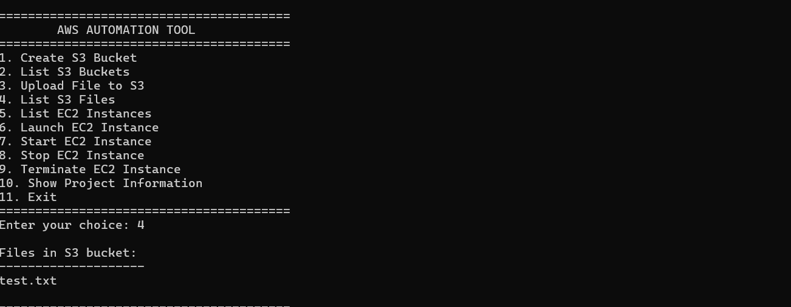
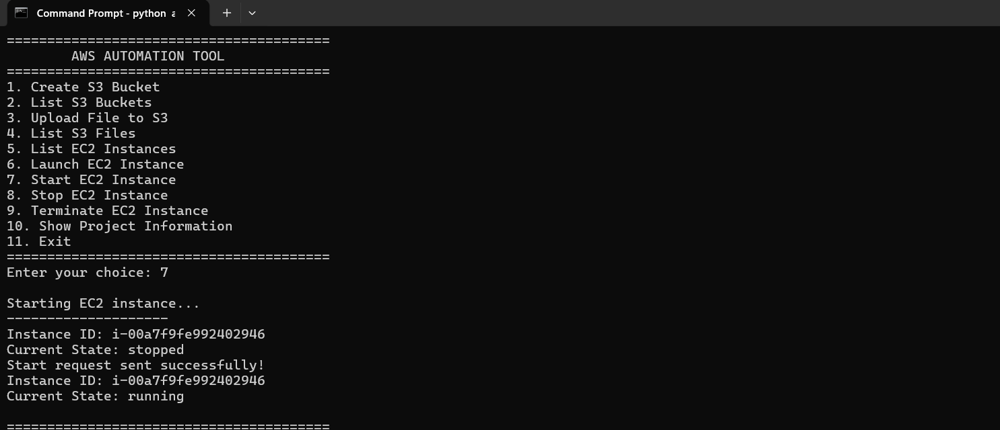
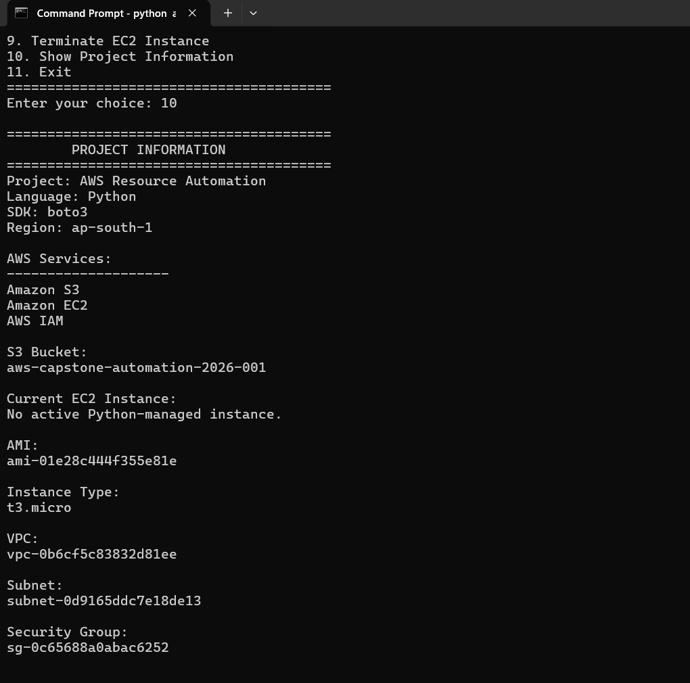

# Project 2 - AWS Resource Automation Using Python and Boto3

## 1. Project Overview

This project demonstrates how Python and Boto3 can be used to automate common AWS resource management tasks.

Instead of performing every operation manually through the AWS Management Console, this project provides a simple command-line application that can interact with Amazon S3 and Amazon EC2.

The project also demonstrates how AWS IAM, AWS CLI profiles, and Boto3 work together to securely automate AWS resources.

## 2. Objective

The main objectives of this project are:

* Automate AWS resource operations using Python.
* Use Boto3 to communicate with AWS services.
* Automate Amazon S3 bucket and file operations.
* Automate Amazon EC2 instance management.
* Use IAM to control access and permissions.
* Use a dedicated AWS CLI profile for authentication.
* Provide a simple menu-driven interface for AWS automation.
* Understand how AWS resources can be managed programmatically.

## 3. AWS Services Used

| AWS Service | Purpose                                            |
| ----------- | -------------------------------------------------- |
| Amazon S3   | Create buckets, upload files, and list objects     |
| Amazon EC2  | List, launch, start, stop, and terminate instances |
| AWS IAM     | Manage users, groups, and permissions              |

## 4. Technologies Used

* Python 3
* Boto3
* AWS CLI
* Amazon S3
* Amazon EC2
* AWS IAM
* Windows Command Prompt

## 5. Project Architecture

The application follows a simple automation architecture.

```text
User
  |
  v
Python CLI Application
  |
  v
Boto3
  |
  v
AWS API
  |
  +----------------------+
  |                      |
  v                      v
Amazon S3             Amazon EC2
  |                      |
  v                      v
S3 Bucket              EC2 Instance
and Files              Lifecycle
                         |
                         v
                  Start / Stop /
                    Terminate

            AWS IAM
               |
               v
       Access and Permissions
```

The user selects an operation from the Python CLI application.

The application uses Boto3 to send the required request to AWS. AWS IAM checks whether the configured identity has permission to perform the requested operation.

The request is then processed by Amazon S3 or Amazon EC2, and the result is returned to the Python application.

## 6. How the Project Works

The application starts with a menu that allows the user to select an AWS operation.

The Python application uses Boto3 to communicate with AWS services.

### S3 Operations

The application can:

1. Create or check an S3 bucket.
2. List available S3 buckets.
3. Upload a file to the project bucket.
4. List files stored in the bucket.

### EC2 Operations

The application can:

1. List EC2 instances.
2. Launch an EC2 instance.
3. Start an EC2 instance.
4. Stop an EC2 instance.
5. Terminate an EC2 instance.

The application also identifies an existing project EC2 instance using its Name tag instead of requiring the user to manually enter an instance ID.

## 7. Project Structure

```text
Project-2-AWS-Automation/
|
+-- .gitignore
+-- README.md
+-- aws_automation.py
+-- requirements.txt
+-- test_aws.py
|
+-- sample/
|   +-- test.txt
|
+-- screenshots/
    +-- 01-cli-menu.png
    +-- 02-s3-bucket.png
    +-- 03-s3-upload.png
    +-- 04-s3-files.png
    +-- 05-ec2-launch.png
    +-- 06-ec2-stop.png
    +-- 07-ec2-start.png
    +-- 08-ec2-terminate.png
    +-- 09-project-info.png
```

## 8. Screenshots

### 8.1 CLI Menu


### 8.2 S3 Bucket


### 8.3 S3 Upload


### 8.4 S3 Files



### 8.5 EC2 Launch


### 8.6 EC2 Stop


### 8.7 EC2 Start



### 8.8 EC2 Terminate


### 8.9 Project Information



## 9. AWS Configuration

The project uses a dedicated AWS CLI profile named:

```text
aws-capstone
```

The Python application creates a Boto3 session using this profile.

```python
session = boto3.Session(
    profile_name="aws-capstone",
    region_name="ap-south-1"
)
```

The project uses the AWS Mumbai region:

```text
ap-south-1
```

Using a separate AWS CLI profile keeps this project's authentication configuration separate from other AWS CLI profiles.

## 10. IAM Configuration

A dedicated IAM user was created for this project.

### IAM User

```text
aws-capstone-automation
```

### IAM Group

```text
aws-capstone-automation-group
```

### IAM Policy

```text
AWS-Capstone-Automation-Policy
```

The IAM policy provides the permissions required by the Python application to perform S3 and EC2 operations.

The project uses a dedicated IAM identity instead of the AWS root account for automation.

## 11. S3 Automation

The application works with the following S3 bucket:

```text
aws-capstone-automation-2026-001
```

Before creating the bucket, the application checks whether the bucket already exists.

The application can also upload files to the bucket.

The sample file used for testing is:

```text
sample/test.txt
```

The file is uploaded using Boto3.

```python
s3.upload_file(
    file_path,
    bucket_name,
    "test.txt"
)
```

After uploading the file, the application can list the objects stored in the bucket.

Example output:

```text
Files in S3 bucket:
test.txt
```

## 12. EC2 Automation

The application can manage Amazon EC2 instances using Boto3.

The project uses the following configuration:

```text
Instance Type: t3.micro
AMI: Amazon Linux 2023
Region: ap-south-1
```

The application supports the following EC2 operations:

```text
List EC2 Instances
Launch EC2 Instance
Start EC2 Instance
Stop EC2 Instance
Terminate EC2 Instance
```

These operations demonstrate the basic EC2 instance lifecycle.

## 13. Dynamic EC2 Instance Selection

The application can automatically find the EC2 instance created by the project.

The instance uses the following Name tag:

```text
aws-capstone-automation-ec2
```

The program searches for this tag and checks the instance state.

This approach avoids hard-coding an EC2 instance ID in the application.

If an active project instance is found, the application selects it automatically.

If no active instance is found, the application asks the user to launch a new instance.

## 14. EC2 Lifecycle Testing

The EC2 lifecycle was tested using the following sequence:

```text
Running
   |
   v
Stopped
   |
   v
Running
   |
   v
Terminated
```

The project successfully tested:

* EC2 instance listing
* EC2 instance launch
* EC2 stop
* EC2 start
* EC2 termination

## 15. CLI Menu

The application provides the following menu:

```text
AWS AUTOMATION TOOL

1. Create S3 Bucket
2. List S3 Buckets
3. Upload File to S3
4. List S3 Files
5. List EC2 Instances
6. Launch EC2 Instance
7. Start EC2 Instance
8. Stop EC2 Instance
9. Terminate EC2 Instance
10. Show Project Information
11. Exit
```

The user selects an operation by entering the corresponding number.

## 16. Project Information

The application provides a project information option that displays the main AWS configuration used by the application.

The information includes:

* Project name
* Python and Boto3 information
* AWS region
* S3 bucket
* EC2 AMI
* EC2 instance type
* VPC
* Subnet
* Security Group
* Current managed EC2 instance status

## 17. Testing Results

The main operations were tested successfully.

| Operation              | Result     |
| ---------------------- | ---------- |
| S3 bucket check        | Successful |
| S3 bucket listing      | Successful |
| S3 file upload         | Successful |
| S3 file listing        | Successful |
| EC2 instance listing   | Successful |
| EC2 instance launch    | Successful |
| EC2 instance selection | Successful |
| EC2 stop               | Successful |
| EC2 start              | Successful |
| EC2 termination        | Successful |
| Project information    | Successful |

## 18. Installation

Clone the repository:

```bash
git clone <YOUR-GITHUB-REPOSITORY-URL>
```

Move into the project directory:

```bash
cd Project-2-AWS-Automation
```

Create a virtual environment:

```bash
python -m venv venv
```

Activate the virtual environment on Windows:

```bash
venv\Scripts\activate
```

Install the required Python packages:

```bash
pip install -r requirements.txt
```

## 19. AWS CLI Configuration

Configure the dedicated AWS CLI profile:

```bash
aws configure --profile aws-capstone
```

Verify the configured AWS identity:

```bash
aws sts get-caller-identity --profile aws-capstone
```

The AWS credentials must never be added to the source code or uploaded to GitHub.

## 20. Run the Application

Run the Python application:

```bash
python aws_automation.py
```

The application displays the AWS Automation Tool menu.

The user can select an operation by entering its menu number.

## 21. Security Practices

The project follows basic AWS security practices:

* AWS credentials are not stored in the Python source code.
* AWS credentials are not uploaded to GitHub.
* Private key files are excluded using `.gitignore`.
* AWS credential directories are excluded using `.gitignore`.
* A dedicated IAM user is used for the project.
* IAM permissions are provided through an IAM policy.
* A separate AWS CLI profile is used for authentication.
* The AWS root account is not used for application automation.

## 22. Key Learnings

Through this project, I learned how to:

* Use Boto3 to communicate with AWS.
* Automate Amazon S3 operations using Python.
* Automate Amazon EC2 operations using Python.
* Create and use an AWS CLI profile.
* Configure IAM users, groups, and permissions.
* Build a menu-driven Python automation application.
* Manage the EC2 instance lifecycle programmatically.
* Work with AWS APIs through Boto3.
* Apply basic AWS security practices.

## 23. Future Improvements

The project can be extended with additional features such as:

* EC2 status monitoring.
* Support for multiple S3 buckets.
* Detailed operation logging.
* Better error handling.
* Command-line arguments.
* Automation for additional AWS services such as Lambda and DynamoDB.

## 24. Conclusion

This project demonstrates how Python and Boto3 can be used to automate common AWS resource management tasks.

The application provides a simple command-line interface for managing Amazon S3 and Amazon EC2 resources.

The project provided practical experience with Python, Boto3, AWS CLI, IAM, Amazon S3, Amazon EC2, and AWS API-based automation.
